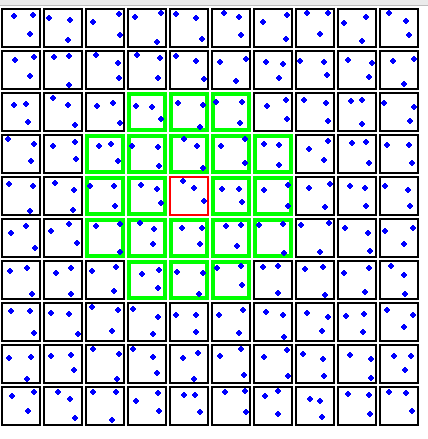

# Calculation of the Distribution of Connected Component Size
Code written in Python 3. 

Consider the plane as a grid with cells of dimensions 0.5 times the limiting distance. By choosing this distance, all points within the same cell are mathematically guaranteed to belong to the same connected component. Consequently, we only need to examine the equivalent of 20 neighboring cells where neighbors can be found mathematically.





Run the program and use it for some examples! ♟️
```
python3 calculate.py example.pts
```

### Example Moves
Moves should have the following format:
```
example.pts
```
You can check the file to know how to enter the points.